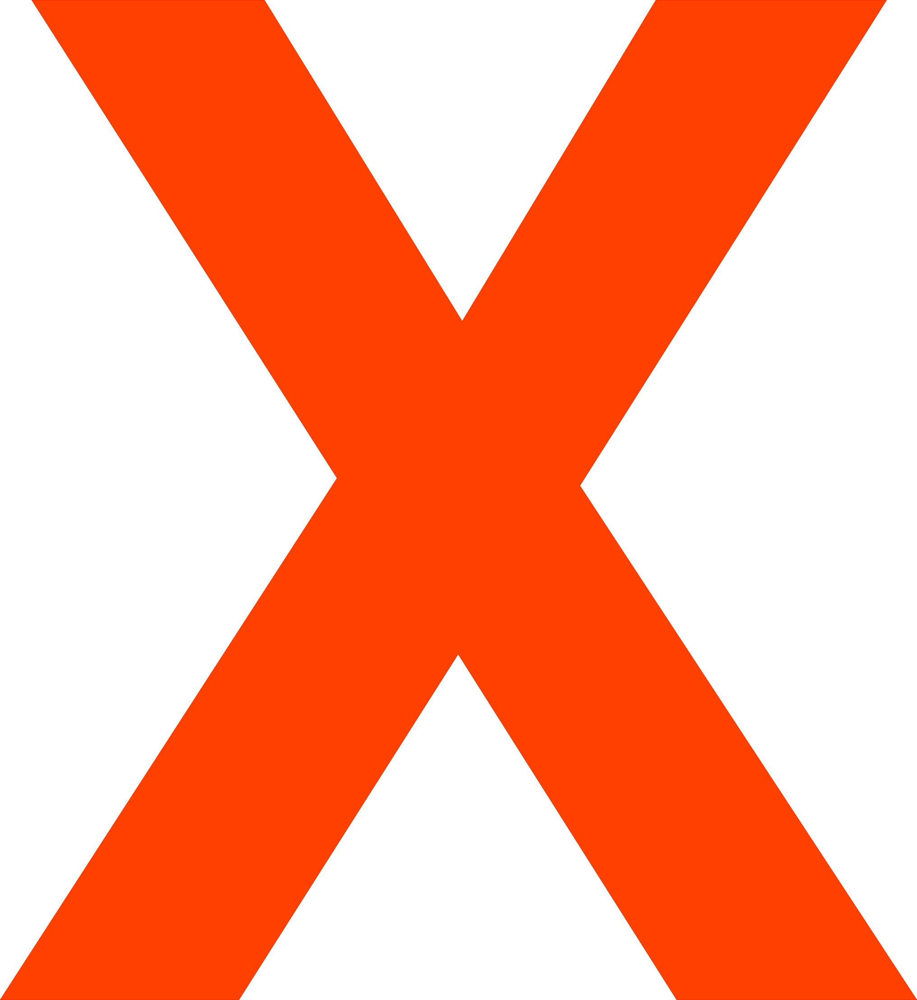

**Do we need another "X" Language?**
Well, no. But we want it.  We want to create a language that is easy to use, easy to learn, and easy to implement.  We want to create a language that is easy to read and easy to write.  We want to create a language that is easy to understand and creates beautiful cross-platform apps.  Leveraging beautiful GUI libraries.

Being built from a kind of scratch to be Cloud-ready, XR-focused, and mobile-first. Yet is still Desktop-friendly.

 (ง︡'-'︠)ง That's a big feature list... we are going to do it. (ง'-'︡ง)

**EXTENSIBLE PROGRAMMING LANGUAGE**

*XPL or X++ is a programming language that is designed to be easy to use and easy to learn. It is a compiled language that is designed to be compiled into C++ code. It is designed to be a general-purpose language that can be used for anything yet is leveraging the power of C++ to make it easier to make API calls and create simple programs with NICE interfaces.*

Our goal is to create a truly unique Cross(X) platform language that can be used to create anything from a simple task manager to a full-blown game engine.

It is a high-level scripting language, that is attempting to be a true programming language.
Not optimized for compilation speed yet for ease of use and readability.  It is considered a Mark-up Language with advanced features that allow it to be leveraged as a programming language.

Although we are not focusing on speed, we are focusing on the ability to create *fast* programs that can be used on any platform.  In the future, we plan on implementing a JIT compiler to make it even faster, as well as Garbage Collection, and a Memory Management System.

XPL uses the [K&R](https://en.wikipedia.org/wiki/Indentation_style#K&R_style), [Style indentation](https://en.wikipedia.org/wiki/Indentation_style).

When following K&R, each function has its opening brace at the next line on the same indentation level as its header, the statements within the braces are indented, and the closing brace at the end is on the same indentation level as the header of the function at a line of its own. 

We use [ ] instead of { } to make it easier to read and write. We believe { } should be used for JSON and other data structures.

The same applies to the IF, (GRAB = FOR), and (LOOP = WHILE) statements.

    IF (condition)[
        Logic();
    ]

**FEATURES Inspired By Great Programming Languages**

    COMPILED - Fast Binaries and Fast Execution [C++]

    EXTENSIBLE - Meaning you can add your own features to the language [C++ Libraries]

    EASY TO USE - Easy and Fun to learn, Readable and Understandable [Python, C#]

    CROSS PLATFORM - Leveraged on any Platform [JavaScript]

    OBJECT ORIENTED - Object-Oriented Programming [Objective C]

    FUNCTIONAL - Functional Programming Features 

    LINE - Line-by-Line Execution [Python]

    STRICT - Strict Syntax

    CHAINED - Chained Syntax [Swift]

    MODEL - Model-Based Programming [Swift]

    DYNAMIC INFERENCE  - Dynamic Type you don't have to declare types, yet strongly recommended [Python]

    STATIC INFERENCE - Static Type, must declare types [C++] or be Warned [C#] Disable in Compiler Options

**Define a Variable <TYPE>**

A variable should be defined with a type.
Generally, you can define and set a variable by using the following syntax:

    <TYPE> <NAME>: <VALUE>

TYPE is the type of variable you are defining. NAME is the name of the variable. VALUE is what you want the variable to be set to.
  
This can be any of the following:

    STRING Welcome: "Hello World!"
    Define a String Variable

    INDEX Greetings: ["Hello", "Hey!", "Hi!"]
    Array/Dictionary/LIST type.  Can be used as an index.

    FLOAT Float: 12.0 
    Extended Float High Precision - Memory intensive

    INTEGER Int: 10
    Define and Assign an integer.

    BOOL Check: TRUE/FALSE/EXIST
    Bool Check with Safe Check.

    OBJECT Obj: { "Key": "Value" }
    JSON Object-like based Indexing System

Required: Types should be ALL-Caps and should be defined before the variable name. The variable should be defined in Cap-Case: Meaning the first letter capitalized and the rest lowercase, while spaces should NOT be used when defining variable names.

*Example: This_Is_A_Variable*

The VALUE of the variable should be assigned as needed.

**CREATE A Function**

Type/Class/Method/Function: are implemented in First Letter Capitalized yet you can use all caps if you want. 

    VOID CREATE X()[
        DISPLAY[Greeting]
    ]

**Call A Function**

CALL: EXECUTE/USE/GET/SET
    
    CALL X()

**CREATE an Instance of a... Class**

NEW: To implement a NEW instance of a class, you must use the NEW keyword.  In this example, NEW will create a new instance of the "X" class and name it "X2". 

    NEW X2 X()

**RIDE and CREATE an Instance of... Class with Parameters**

 You can also use the RIDE keyword to create a new instance of a class that implements the RIDEABLE interface.  This will allow you to create a new instance of a class that implements the RIDEABLE interface for overwriting classes a type of INHERITANCE/POLYMORPHISM paradigm.

*Convention: Parameters All-Lower case.*

    RIDE NEW X2 X(STRING string, INTEGER int)[
        DISPLAY[string]
        DISPLAY[int] #Convention: Pass variable ARGUMENTS
    ]

**GRAB to ITERARATE through an INDEX**
 
    GRAB Greeting IN Greetings[
        DISPLAY[Greeting]
    ]

    #Display "Hello!"
    #Display "Hey"
    #Display "Hi"
